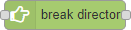
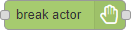
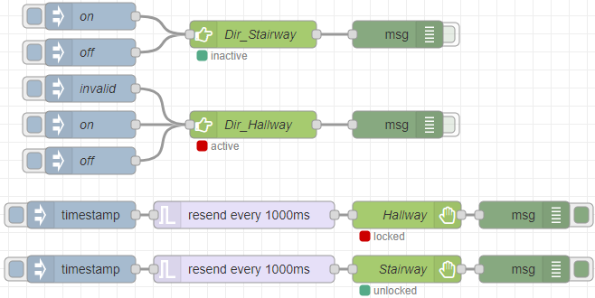
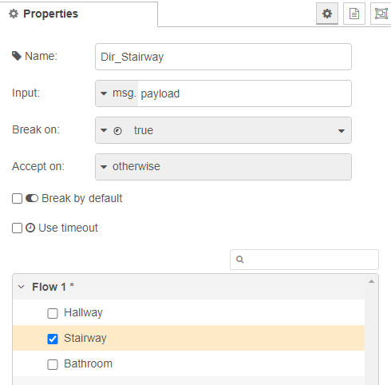
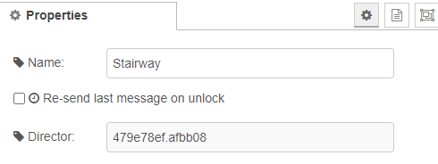

# node-red-contrib-switch-break
The switch break director node is a mid point listener that only sits between a two nodes and listens to data traffic.
If the data matches *Break on* value, it will send a break signal to the connected actors that disables their traffic throughput.
If the data matches *Accept on* value, a removal of the break will be sent to all connected actors and enables their traffic again.

  
  

**Fig. 2:** Node appearance

## Installation

### In Node-RED (preferred)
* Via Manage Palette -> Search for "node-red-contrib-switch-break"

### In a shell
* go to the Node-RED installation folder, e.g.: `~/.node-red`
* run `npm install node-red-contrib-switch-break`

## Usage

 
**Fig. 3:** Node explaination
To give an understanding on how the node works, we can take a look at this where you have two  that will listen to inputs, investigate the data send it through. When the investigation of the data is done, it can, depending on the data:
* Nothing
* Activate the break (if matching the **Break on** value).
* Deactivate the break (if matching the **Accept on** value).

When an activation of the break is done, it sends a lock signal to all connected  nodes that will stop all traffic going through the actor node. And if a deactivation of the break is done, it sends a unlock signal that will let the signals of the actors through.

The second part is the . These works like a denial of service and halt the traffic when locked by the .

  
**Fig. 3:** Node appearance
DATA

### Node Configuration
The node configuration sets up how the  should react.

  
**Fig. 3:** Node properties

#### Name (optional)
*(Optional)* The name of this node. *(Will change the content of the node to the name)*

#### Input
The value to read and validate against the **Break on** and **Accept on** values.

#### Break on  / Accept on
The **input** value needs to match one of these fieds to trigger an action, or nothing will happen.
As explained for the **input** field, the break and accept will only be sent to the connected actor nodes if matching one of these fields.

#### Break by default
If **checked**, the initial state of the  and all its connected  will be in a break/lock state and deny traffic going through, otherwise *(if not checked)*, it will accept traffic.

#### Use timeout
If **checked**, then a time out can be set that will automatically reset the director's and all its connect actors to the default state.

#### Time out
The time to wait before returning to the default **Break on default** state.

#### The box
The box will present all the available actors that has not yet been assigned to a director.
All the selected actors will be linked to this director and react to its state changes.

### Node Configuration
The node configuration sets up how the  should react.

  
**Fig. 4:** Node properties

#### Name (optional)
*(Optional)* The name of this node. *(Will reflect what's shown on the node, but also the name in the directors list.)*

#### Re-send last message on unlock
If **checked**, the last received message will be sent through as soon as this actor entering an <b>unlocked</b> state.

#### Director
Informs about the break director that is connected.

## Examples
***
**Remark**: Example flows are present in the examples subdirectory. In Node-RED they can be imported via the import function and then selecting *Examples* in the vertical tab menu.
***

### Example 1: Basic usage
This example shows the basic usage.
The configuration simulates two different directors and two actors *(one actor per director)* and gives you the option to manually activate and deactive the break for a director to try out the functionality and see how it affects the actors.

[**example-1.json**](examples/example-1.json)  
**Fig. 5:** Basic usage example

## Version history
v1.0.0 Initial release

## Credits
- [TLacke](https://github.com/TLacke)